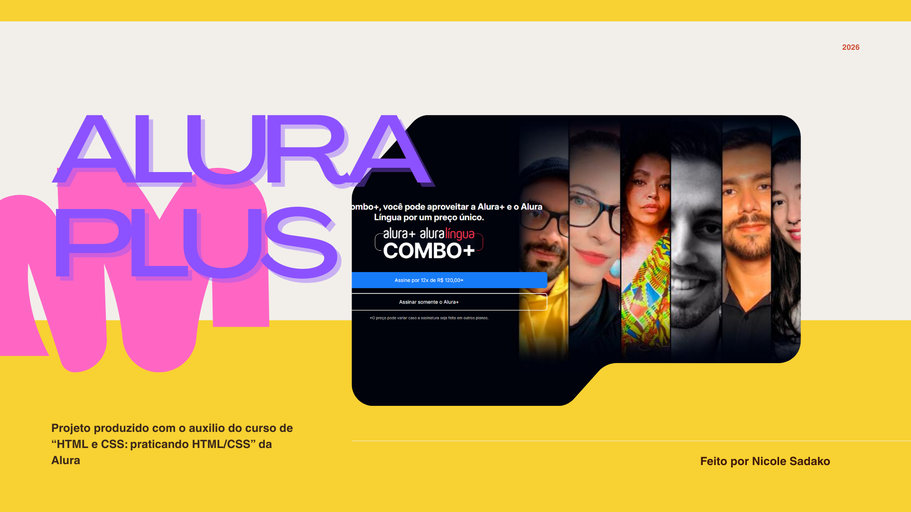

<h1 align="center"> Alura Plus </h1>

  

## 🚀 Tecnologias

Esse projeto foi desenvolvido com as seguintes tecnologias:

- HTML e CSS
- Git e Github
- Figma

## 💻 Projeto
Um site apresentando o conteúdo do Alura+ baseado num projeto do Figma.
- [Acesse o projeto finalizado](https://aluraplus-snowy-eta.vercel.app/)
